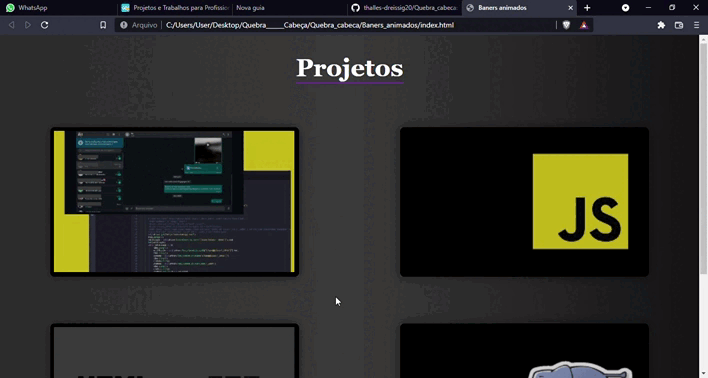
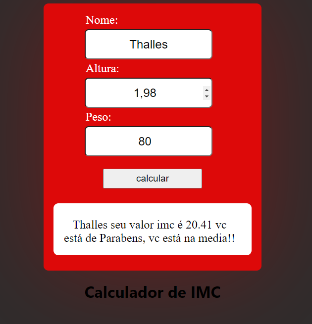
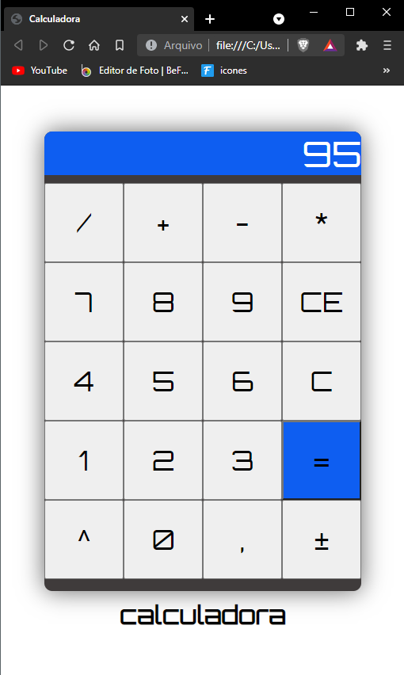
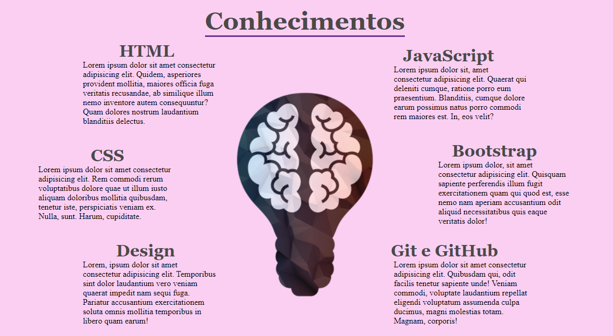
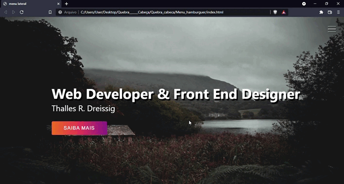
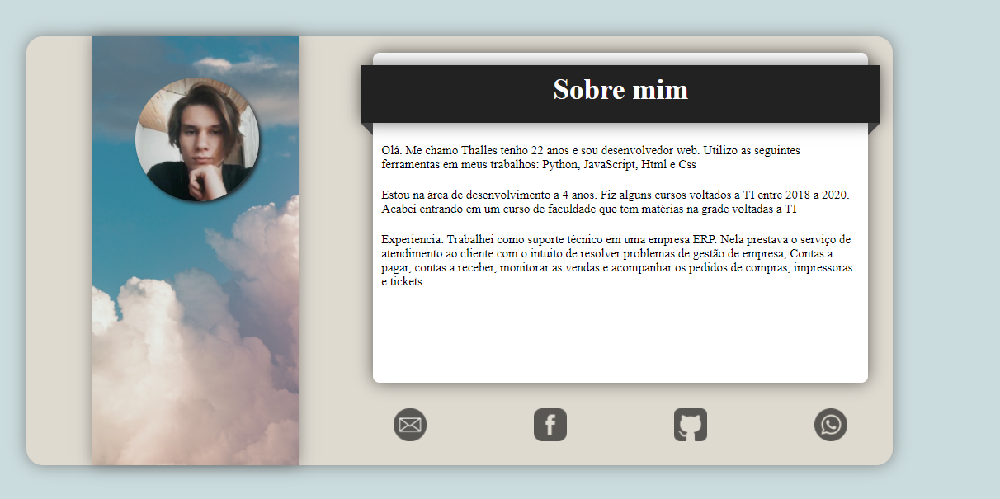

# Quebra_cabeca
### Varias partes de sites: Javascript, Html e Css
## Banners Animados
Banners animados com css e html
 

 

## Calculador de IMC
calculador de IMC com javascript
 

 

## Calculadora
Calculadora feita em Javascript
 

 

## Cronometro
Cronometro feito em Javascript

## Data e Hora
Programa mostra o horario atual mostrando imagens diferentes feito em Javascript

## Loja virtual
Fiz uma "Loja" em html css e javascript para demonstrar os resultado com responsividade.
 Fiz algumas alterações de responsividade em resoluções mais baixas.

## Aprendendo a manipular o display Grid
 

 

## Menu Hamburguer como animação
 

 

## Página de apresentação
 

 

## Pagina de login
 

 

## Pagina sobre

 

