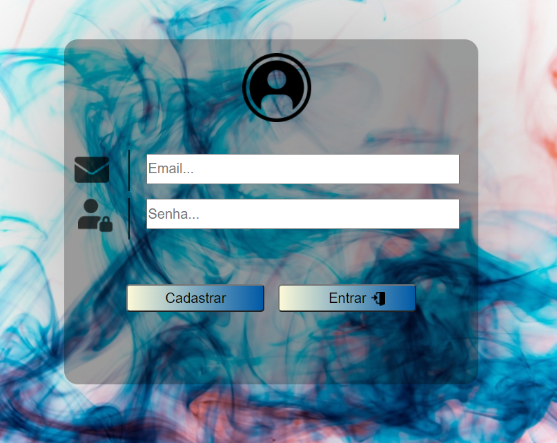

# Quebra_cabeca
 Varias partes de sites: Javascript, Html e Css
## Banners Animados
 

 

## Calculador de IMC
 

 

## Calculadora
 

 

## Cronometro

## Data e Hora

## Loja virtual

## Aprendendo a manipular o display Grid
 

 

## Menu Hamburguer como animação
 

 

## Página de apresentação
 

 

## Pagina de login
 

 

## Pagina sobre

 

